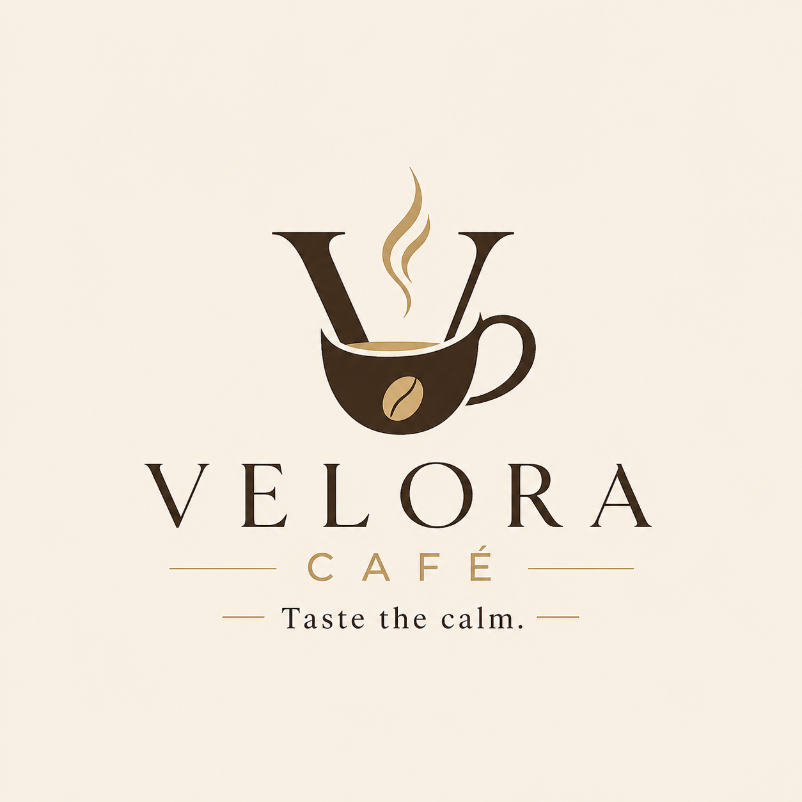

# ☕ Velora Café

* **Taste the calm.**

---

## 🌐 Preview

> A modern online café experience combining aesthetic design with a smooth user interface.

🔗 Live Demo: *(coming soon!)*
📸 Screenshots: (./screenshot.png)

---

## ✨ Brand Philosophy

Velora Café is designed as a calm, aesthetic space where every cup becomes part of your daily moments.
From the first sip to the last, the experience is crafted to feel natural, warm, and memorable.

---

## 🚀 Features

* ☕ Modern café UI/UX
* 🔐 Authentication system (JWT / session)
* 🛒 Online ordering system *(opsiyonel)*
* 📱 Responsive design
* ⚡ Fast performance (optimized frontend)

---

## 🛠️ Tech Stack

**Frontend:**

* Nuxt.js
* Tailwind CSS

**Backend:**

* Laravel 

**Database:**

* PostgreSQL

**Deployment:**

* Vercel / Railway

---

## 🎨 Design System

**Colors**

* Primary: #2C1A14
* Secondary: #F5EFEA
* Accent: #C8A96A

---

---

## 📄 License

This project is open-source and available under the MIT License.

---

## 🤝 Contributing

Contributions are welcome! Feel free to open issues or submit pull requests.
