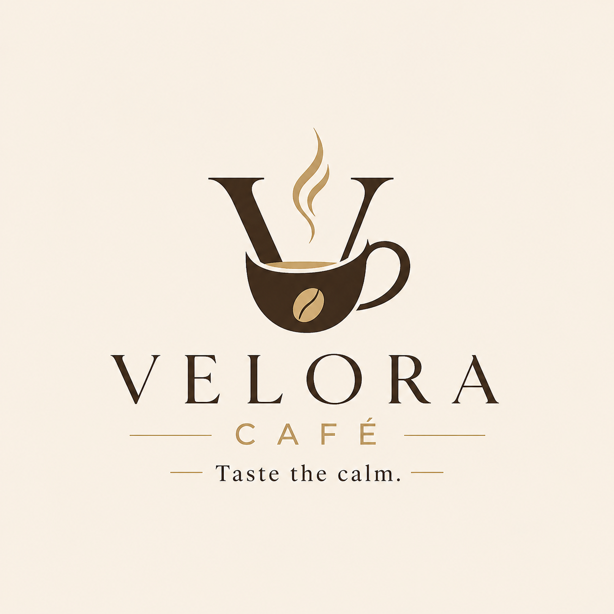
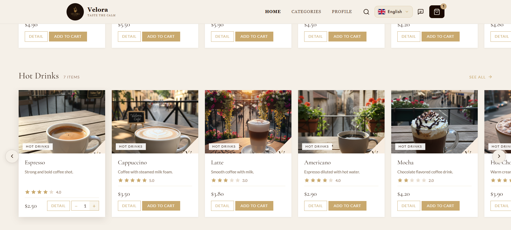

# ☕ Velora Café



**Taste the calm.**

---

## 🌐 Preview

> A modern online café experience combining aesthetic design with a smooth user interface.



---

## ✨ Brand Philosophy

Velora Café is designed as a calm, aesthetic space where every cup becomes part of your daily moments.
From the first sip to the last, the experience is crafted to feel natural, warm, and memorable.

---

## 🚀 Features

* ☕ Modern café UI/UX
* 🔐 Authentication system
* 🛒 Online ordering system
* 📊 Analytics dashboard with charts (Chart.js)
* 🌍 Multi-language support (i18n)
* 📅 Calendar / reservation support
* 📱 Fully responsive design
* ⚡ Optimized frontend performance

---

## 🛠️ Tech Stack

**Frontend** (`velora-front`)

* Nuxt 4
* Vue 3
* Tailwind CSS
* Chart.js
* @nuxtjs/i18n

**Backend** (`velora-backend`)

* Laravel 12
* PHP 8.2+
* Laravel Sanctum (authentication)

**Database**

* PostgreSQL

---

## 📁 Project Structure

```
velora-online-cafe-full-project/
├── velora-backend/   # Laravel API
├── velora-front/      # Nuxt 4 frontend
├── logo.png
└── screenshot.png
```

---

## ⚙️ Getting Started

### Backend

```bash
cd velora-backend
composer install
cp .env.example .env
php artisan key:generate
php artisan migrate
php artisan serve
```

### Frontend

```bash
cd velora-front
npm install
npm run dev
```

---

## 🎨 Design System

**Colors**

| Name      | Hex       |
| --------- | --------- |
| Primary   | `#2C1A14` |
| Secondary | `#F5EFEA` |
| Accent    | `#C8A96A` |

---

## 📄 License

This project is open-source and available under the MIT License.

---

## 🤝 Contributing

Contributions are welcome! Feel free to open issues or submit pull requests.
